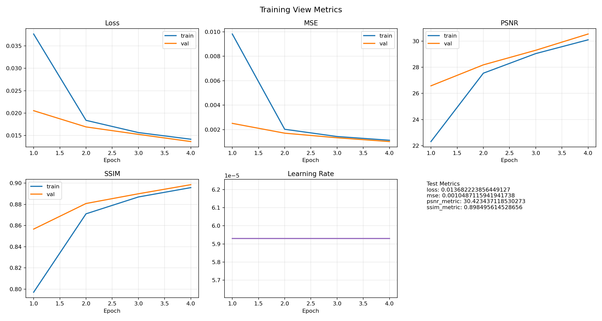

# AI Compressor - Neural Compression for Image, Audio, and Video

Local-first neural compression project with autoencoders for image, audio, and video.

## What is Neural compression

Traditional codecs (JPEG/MP3/H.264) are hand-engineered. Neural compression learns compact latent representations with an encoder/decoder and optimizes reconstruction quality directly for your target data and constraints.

## Current benchmark snapshot (July 2026)

| Modality | Test PSNR | Test MSE | Test Loss | Test SSIM/SNR |
|----------|----------:|---------:|----------:|--------------:|
| Image    |    30.645 |    0.001 |     0.004 |    SSIM 0.983 |
| Audio    |    32.223 |    0.001 |     0.024 | SNR 21.981 dB |
| Video    |    30.423 |    0.001 |     0.014 |    SSIM 0.898 |

Average across best models:

- Test PSNR: **31.097**
- Best validation PSNR: **31.213**
- Final training PSNR: **29.391**

## Model Hyperparameters
Best model hyperparameters for each modality (from the current best runs):

| Modality | Latent Dim | Encoder Depth | Decoder Depth | Learning Rate | Batch Size | Epochs |
|:---------|-----------:|--------------:|--------------:|--------------:|-----------:|-------:|
| Image    |        128 |             4 |             4 |         0.001 |         32 |     50 |
| Audio    |         64 |             3 |             3 |        0.0005 |         16 |     50 |
| Video    |        192 |             5 |             5 |        0.0001 |          8 |     15 |


## Training Metrics  (x-axis : Epochs)
### Image Model:

image model training metrics (PSNR, MSE, Loss, SSIM) over epochs
### Audio Model:

audio model training metrics (PSNR, MSE, Loss, SNR) over epochs
### Video Model:

video model training metrics (PSNR, MSE, Loss, SSIM) over epochs

## Preview reconstruction quality of best models
preview of reconstruction quality for best models on test data, showing original and reconstructed samples.
### Image:


### Audio:

Playback audio: [audio_preview_reconstruction.wav](models/production_bundle/best_20260702_235656/audio/audio_preview_reconstruction.wav)
### Video:


Source reports:

- `models/random_search_goal30/image/trial_001/20260702_230938/evaluation_report.md`
- `models/random_search_goal30/audio/trial_001/20260702_182301/audio_evaluation_report.md`
- `models/random_search_goal30/video/trial_001/20260702_183130/video_evaluation_report.md`

## Quick start

```zsh
python3 -m venv .venv
source .venv/bin/activate
pip install --upgrade pip
pip install -r requirements.txt
```

## Core commands

For easier model configuration, all autoencoder trainers now support `--params-file` (JSON). See `documentation/MODEL_PARAMS_INPUT.md` and `documentation/model_params_example.json`.

Train image:

```zsh
python train_autoencoder_image_local.py --preset m1-air-balanced --data-dir data --output-root models/local_run
```

Train image on real data only (crop-based patch expansion, no dummy fallback):

```zsh
python train_autoencoder_image_local.py --preset m1-air-quality --data-dir data/ImageData --real-only --train-patches-per-image 6 --upscale-factor 2 --degrade-interp bicubic --target-psnr 60 --output-root models/image_real_only
```

Train image with explicit split folders and external holdout (no split leakage):

```zsh
python train_autoencoder_image_local.py --preset custom --train-dir "data/cifar10 2/train" --val-dir "data/cifar10 2/val" --test-dir "data/cifar10 2/test" --holdout-dir data/ImageData --real-only --disable-target-psnr-stop --target-psnr 50 --epochs 20 --batch-size 8 --block-size 64 --train-patches-per-image 2 --upscale-factor 2 --degrade-interp bicubic --output-root models/image_explicit_split
```

Train image (lossy + file-size focused):

```zsh
python train_autoencoder_image_lossy_local.py --preset custom --train-dir "data/cifar10 2/train" --val-dir "data/cifar10 2/val" --test-dir "data/cifar10 2/test" --real-only --epochs 28 --batch-size 8 --block-size 96 --latent-dim 64 --rate-lambda 0.006 --jpeg-quality 88 --target-compression-ratio 0.85 --output-root models/image_lossy_local_run
```

Train image (lossy, less aggressive, real-data-only):

```zsh
python train_autoencoder_image_lossy_local.py --preset custom --train-dir "data/cifar10 2/train" --val-dir "data/cifar10 2/val" --test-dir "data/cifar10 2/test" --real-only --epochs 40 --batch-size 6 --block-size 128 --latent-dim 96 --rate-lambda 0.004 --sample-count 32 --jpeg-quality 90 --target-compression-ratio 0.80 --output-root models/image_lossy_real_only
```

The lossy trainer writes matched-PSNR JPEG/WebP baseline benchmark stats into `evaluation_report.md` by default. Disable with `--no-run-baseline-benchmark`.

Train audio:

```zsh
python train_autoencoder_audio_local.py --preset m1-air-balanced --output-root models/audio_local_run
```

Prepare canonical audio dataset (mp3/flac/ogg/wav -> mono PCM16 WAV + metadata):

```zsh
python prepare_audio_dataset.py --input-dir data/AudioData --output-dir data/AudioData_canonical --target-sample-rate 16000 --output-format wav --normalization rms_peak --target-rms 0.12 --target-peak 0.95 --remove-dc
```

Train video:

```zsh
python train_autoencoder_video_local.py --preset m1-air-balanced --output-root models/video_local_run
```

Supported real-video extensions for training/comparisons: `.mp4`, `.mov`, `.mkv`, `.avi`, `.webm`, `.m4v`.

Generate real audio/video comparison panels:

```zsh
python generate_real_av_comparisons.py --audio-dir data/AudioData/ESC-50-master/audio --video-dir "data/VIDEO DATA"
```

Run constrained random search:

```zsh
python random_search_hyperparams.py --modality image --resource-profile tiny --trials 10 --max-minutes 25
python random_search_hyperparams.py --modality image --image-trainer lossy --resource-profile tiny --trials 10 --max-minutes 25
python random_search_hyperparams.py --modality audio --resource-profile balanced --trials 12 --search-config documentation/random_search_profile.json
```

Random-search spaces/fixed args can be centrally edited in `documentation/random_search_profile.json` (see `documentation/RANDOM_SEARCH_PROFILE.md`).

Run full production pipeline (search -> train image upscaler/lossy/audio -> bundle -> optional prune):

```zsh
python run_full_production_pipeline.py --trials-image-standard 10 --trials-image-lossy 10 --trials-audio 8
python run_full_production_pipeline.py --trials-image-standard 10 --trials-image-lossy 10 --trials-audio 8 --apply-prune
```

Smoke test:

```zsh
python smokeTests/smoke_test_random_search.py
python smokeTests/smoke_test_image_lossy_local.py
python smokeTests/smoke_test_prepare_audio_dataset.py
python smokeTests/smoke_test_full_production_pipeline.py
```

## Outputs

Each run writes artifacts and metrics under `models/.../<timestamp>/` including:

- model weights/checkpoints (`.h5`, `.keras`, optionally `.tflite`)
- training curves (`*.png`)
- evaluation reports (`evaluation_report.md`, `audio_evaluation_report.md`, `video_evaluation_report.md`)

Audio preparation pipeline outputs canonical files under your chosen `--output-dir` with per-file sidecars (`*.metadata.json`) and a run report (`preparation_report.md`).

## Project constraints

- Optimized for laptop iteration; compute and thermal limits constrain model size and epochs.
- Image trainers in this repo are now intended for real-data and CIFAR-backed runs; keep explicit train/val/test splits where possible.
- Search loops are sequential and wall-clock bound.
- Video is the most expensive path and highly sensitive to clip shape (`frames`, `height`, `width`).

## Better hardware path

On stronger GPUs/cloud, prioritize:

1. More real data with cleaner split hygiene.
2. Larger models (`latent_dim`) and longer schedules (`epochs`).
3. Higher-fidelity inputs (bigger image patches, longer audio clips, larger video clips).
4. Broader/parallel hyperparameter search.
5. Deployment metrics (latency, memory, throughput) in addition to PSNR/SSIM/SNR.

