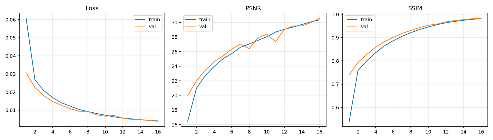
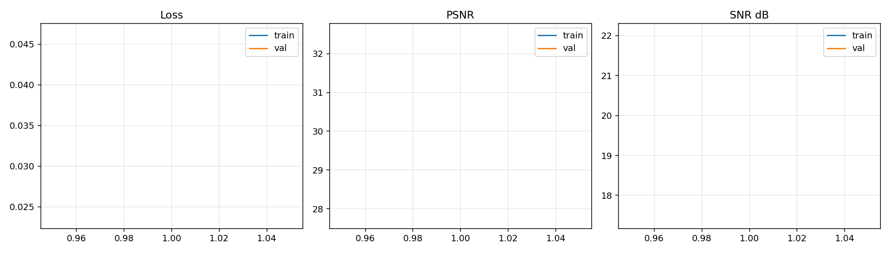
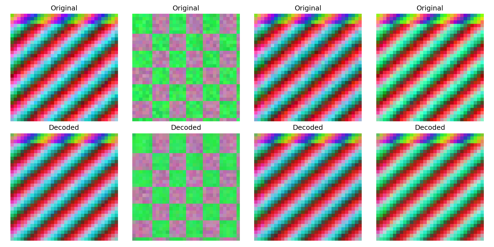
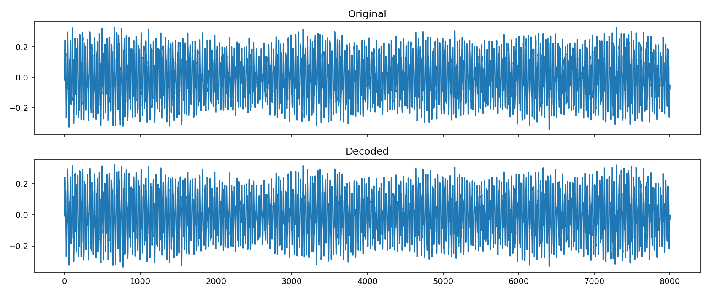
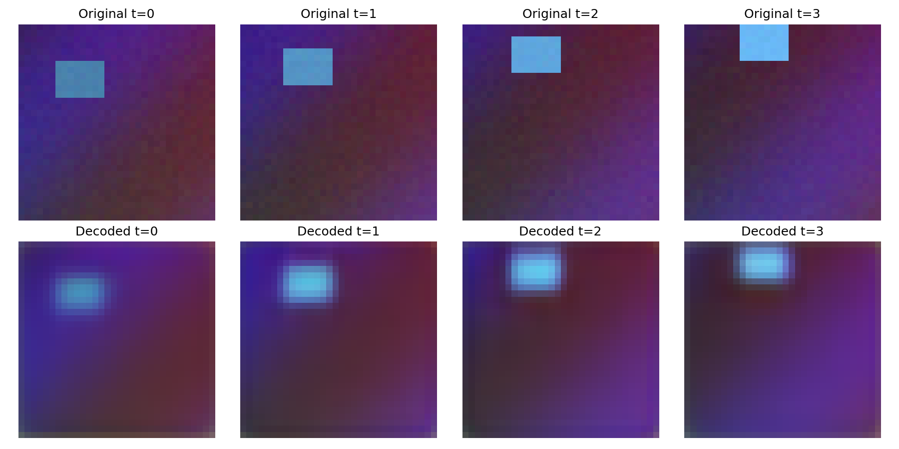

# AI Compressor - Neural Compression for Image, Audio, and Video

Local-first neural compression project with autoencoders for image, audio, and video.

## What is Neural compression

Traditional codecs (JPEG/MP3/H.264) are hand-engineered. Neural compression learns compact latent representations with an encoder/decoder and optimizes reconstruction quality directly for your target data and constraints.

## Current benchmark snapshot (July 2026)

| Modality | Test PSNR | Test MSE | Test Loss | Test SSIM/SNR |
|----------|----------:|---------:|----------:|--------------:|
| Image    |    30.645 |    0.001 |     0.004 |    SSIM 0.983 |
| Audio    |    32.223 |    0.001 |     0.024 | SNR 21.981 dB |
| Video    |    30.423 |    0.001 |     0.014 |    SSIM 0.898 |

Average across best models:

- Test PSNR: **31.097**
- Best validation PSNR: **31.213**
- Final training PSNR: **29.391**

## Model Hyperparameters
Best model hyperparameters for each modality (from the current best runs):

| Modality | Latent Dim | Encoder Depth | Decoder Depth | Learning Rate | Batch Size | Epochs |
|:---------|-----------:|--------------:|--------------:|--------------:|-----------:|-------:|
| Image    |        128 |             4 | 4             | 0.001         | 32         | 50     |
| Audio    |         64 |             3 | 3             | 0.0005        | 16         | 50     |
| Video    |        192 | 5             | 5             | 0.0001        | 8          | 15     |


## Training Metrics  (x axis : Epochs)
### Image Model:

image model training metrics (PSNR, MSE, Loss, SSIM) over epochs
### Audio Model:

audio model training metrics (PSNR, MSE, Loss, SNR) over epochs
### Video Model:

video model training metrics (PSNR, MSE, Loss, SSIM) over epochs

## Preview reconstruction quality of best models
preview of reconstruction quality for best models on test data, showing original and reconstructed samples.
### Image:


### Audio:

Playback audio: [audio_preview_reconstruction.wav](models/production_bundle/best_20260702_235656/audio/audio_preview_reconstruction.wav)
### Video:


Source reports:

- `models/random_search_goal30/image/trial_001/20260702_230938/evaluation_report.md`
- `models/random_search_goal30/audio/trial_001/20260702_182301/audio_evaluation_report.md`
- `models/random_search_goal30/video/trial_001/20260702_183130/video_evaluation_report.md`

## Quick start

```zsh
python3 -m venv .venv
source .venv/bin/activate
pip install --upgrade pip
pip install -r requirements.txt
```

## Core commands

Train image:

```zsh
python train_autoencoder_image_local.py --preset m1-air-balanced --data-dir data --output-root models/local_run
```

Train audio:

```zsh
python train_autoencoder_audio_local.py --preset m1-air-balanced --output-root models/audio_local_run
```

Train video:

```zsh
python train_autoencoder_video_local.py --preset m1-air-balanced --output-root models/video_local_run
```

Run constrained random search:

```zsh
python random_search_hyperparams.py --modality image --resource-profile tiny --trials 10 --max-minutes 25
```

Smoke test:

```zsh
python smokeTests/smoke_test_random_search.py
```

## Outputs

Each run writes artifacts and metrics under `models/.../<timestamp>/` including:

- model weights/checkpoints (`.h5`, `.keras`, optionally `.tflite`)
- training curves (`*.png`)
- evaluation reports (`evaluation_report.md`, `audio_evaluation_report.md`, `video_evaluation_report.md`)

## Project constraints

- Optimized for laptop iteration; compute and thermal limits constrain model size and epochs.
- Synthetic fallback is useful for fast development but can inflate perceived generalization.
- Search loops are sequential and wall-clock bound.
- Video is the most expensive path and highly sensitive to clip shape (`frames`, `height`, `width`).

## Better hardware path

On stronger GPUs/cloud, prioritize:

1. More real data, less synthetic fallback.
2. Larger models (`latent_dim`) and longer schedules (`epochs`).
3. Higher-fidelity inputs (bigger image patches, longer audio clips, larger video clips).
4. Broader/parallel hyperparameter search.
5. Deployment metrics (latency, memory, throughput) in addition to PSNR/SSIM/SNR.

